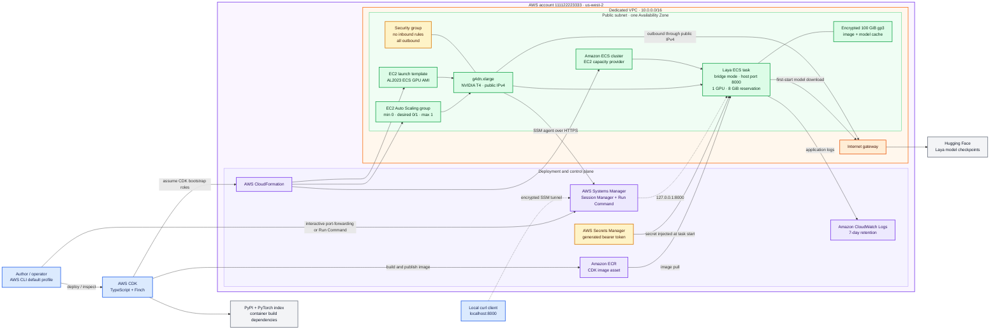

# Architecture design

## Purpose

This stack verifies that Laya can provide the Jev-compatible
`POST /v1/systemone` API on an AWS GPU instance. It is a private proof
environment for validating compatibility, startup behavior, GPU memory, and
warm inference latency before publishing a deployment guide.

The verification stack does not expose Laya as a public internet service.
Interactive requests use an AWS Systems Manager port-forwarding tunnel.
Automated tests use Systems Manager Run Command and call Laya from the EC2
host through `127.0.0.1:8000`.

## Color-coded AWS architecture

The editable Mermaid source is also available in
[`architecture.mmd`](architecture.mmd).



### Color key

| Color | Meaning |
| --- | --- |
| Blue | Operator and local tooling |
| Purple | AWS deployment and managed control services |
| Orange | Network boundary and routing |
| Green | GPU compute, ECS runtime, and storage |
| Yellow | Security controls and credentials |
| Gray | External package and model sources |

## Request paths

### Automated verification

1. `scripts/verify-remote.sh` discovers the ECS container instance.
2. The AWS CLI submits an `AWS-RunShellScript` command through Systems Manager.
3. The command runs on the GPU host, retrieves the generated API key using the
   scoped instance role, and calls `127.0.0.1:8000`.
4. The command reports GPU details, health, model revisions, one response,
   twenty warm latency samples, and GPU memory usage.

No inbound VPC rule is required for this path.

### Interactive verification

1. `scripts/connect.sh` opens a Session Manager port-forwarding session.
2. Local port `8000` is encrypted through Systems Manager to port `8000` on
   the GPU host.
3. `scripts/verify.sh` calls `localhost:8000`, which reaches the Laya task
   through the tunnel.

### Outbound internet path

The instance is in a public subnet and receives a public IPv4 address. Its
default route uses the internet gateway. This allows the ECS agent to reach AWS
public endpoints and lets Laya download model checkpoints from Hugging Face.
The security group permits outbound traffic and has no inbound rules.

A public production API would require a separate ingress design such as
Route 53, ACM, WAF, and an Application Load Balancer or API Gateway. Those
components are intentionally outside this verification stack.

## Resource design

| Area | Current design | Reason |
| --- | --- | --- |
| Compute | One On-Demand `g4dn.xlarge` | NVIDIA T4 provides a low-cost first GPU target |
| Scheduling | ECS EC2 capacity provider | Expresses the one-GPU task requirement |
| Capacity | Context-controlled `0` or `1` | Makes the safe default zero and bounds spend |
| Image | CDK Docker asset in bootstrap ECR | Reproducible deployment from the project |
| Operating system | ECS-optimized Amazon Linux 2023 GPU AMI | Includes ECS and NVIDIA integration |
| Storage | Encrypted 100 GiB gp3 root volume | Holds the large image and first-start model cache |
| Networking | One public subnet, internet gateway, no NAT | Supports downloads without NAT hourly cost |
| Ingress | No security-group inbound rules | Keeps the proof private |
| Administration | Systems Manager | Avoids SSH keys and inbound SSH |
| Authentication | Generated bearer token in Secrets Manager | Avoids credentials in source or parameters |
| Logging | CloudWatch Logs, seven-day retention | Captures startup and inference diagnostics |
| Metadata | IMDSv2 required | Hardens instance metadata access |

## IAM and credential flow

The local AWS CLI obtains credentials from the shared credentials file using
the `default` profile. The last verified caller was:

```text
arn:aws:iam::111122223333:user/EXAMPLE-USER
```

CDK uses the bootstrapped roles in `us-west-2`:

- `cdk-hnb659fds-lookup-role-111122223333-us-west-2`
- `cdk-hnb659fds-deploy-role-111122223333-us-west-2`
- `cdk-hnb659fds-image-publishing-role-111122223333-us-west-2`
- `cdk-hnb659fds-file-publishing-role-111122223333-us-west-2`
- `cdk-hnb659fds-cfn-exec-role-111122223333-us-west-2`

The EC2 instance role has standard ECS registration permissions, Systems
Manager permissions, and read access to only the generated Laya secret. The
task execution role can pull the ECR image, write logs, and retrieve the same
secret for container injection.

Granting the instance role secret access exists only to support the automated
host-side verification script. A production design should remove that grant
and use an application-facing authentication flow.

## Availability and recovery limits

This proof uses one Availability Zone and one GPU instance. It does not provide
high availability. ECS deployment rollback is enabled, the Auto Scaling group
cannot exceed one instance, and the deployment script attempts a zero-capacity
rollback on exit.

The model cache is on the instance root volume and is deleted with the
instance. Returning capacity to zero therefore saves compute and EBS cost but
requires checkpoint downloads on the next cold start.
