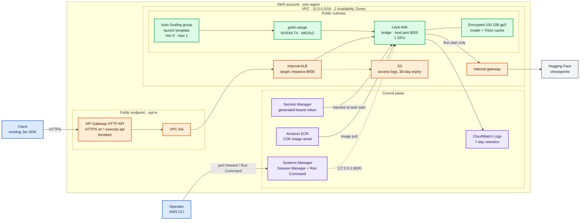

# Architecture

Laya runs as a single Amazon ECS task on one GPU EC2 instance. Everything else
in the stack exists either to reach that task safely or to keep it from costing
money when idle.

There are two access paths, and the public one is opt-in.

## The two paths

**Public, with `-c publicEndpoint=true`.** API Gateway terminates TLS on its
generated `*.execute-api` hostname, so no domain or Route 53 hosted zone is
needed. A `$default` route forwards the request path unchanged, which is what
preserves `POST /v1/systemone` and lets an existing Jev client change only its
base URL. The `Authorization` header passes through untouched, because
authentication stays Laya's own bearer check inside the container. A custom
domain is optional and only changes the front door.

**Private, the default.** No load balancer and no inbound security group rules
at all. Operators reach Laya through Systems Manager, either port forwarding to
`localhost:8000` or Run Command executing against `127.0.0.1:8000` on the host.
This path costs nothing while idle and is how the benchmark harness runs.

## Why these choices

| Decision | Reason |
| --- | --- |
| One `g4dn.xlarge` | The T4 is the cheapest current inference GPU, and both checkpoints fit in 4.1 of its 15.4 GiB |
| Capacity 0 by default | A repository strangers clone must not quietly bill $380 a month |
| ECS on EC2, not a managed endpoint | A managed endpoint's invocation path would break the drop-in protocol match |
| API Gateway in front of an internal ALB | Trusted TLS with no domain, and nothing in the data path exposed to the internet |
| Throttling at API Gateway, not WAF | WAF cannot attach to an HTTP API, and Laya serialises inference through one worker so a rate limit is the control that matters |
| Two Availability Zones | An ALB requires two subnets, and a second AZ gives the Auto Scaling group another chance at scarce GPU capacity |
| Public subnets, no NAT gateway | A NAT gateway would become the dominant idle cost of a stack designed to scale to zero |
| Bearer token in Secrets Manager | Keeps credentials out of source and out of CloudFormation parameters |
| 100 GiB encrypted gp3 root volume | Holds a 7.2 GB image plus checkpoints and the Triton cache |

## Security posture

There are no CIDR-based ingress rules in any configuration. With the public
endpoint enabled, the only rules are security group to security group: port 80
to the load balancer from the VPC link, and port 8000 to the GPU host from the
load balancer.

The task execution role can pull only this stack's image, write only to its log
group, and read only the generated secret. The task role holds no permissions.

The EC2 instance role can read the bearer token **only** when
`-c hostBenchmarkAccess=true` is set. That grant exists so the benchmark can
fetch the token on the host rather than passing it through SSM command
parameters, which are retained in command history and CloudTrail. It is off by
default, because it also means any process on the host can read the token.
Leave it off in production.

IMDSv2 is required, the root volume is encrypted, the container runs as a
non-root user, and load balancer access logs land in an encrypted bucket with
public access blocked and a 30-day expiry.

## Accepted limitations

The GPU host sits in a public subnet with a public IPv4 address. Inbound is
restricted to the load balancer, or denied entirely on the private path, but a
stricter design would use private subnets with a NAT gateway. That was rejected
on cost.

The hop from the load balancer to the container is plaintext HTTP inside the
VPC, so the bearer token is not encrypted on that segment.

The stack runs one task on one instance and is not highly available. Returning
capacity to zero deletes the model and Triton caches with the instance, so the
next cold start pays for both again.

Model checkpoint revisions are not pinned, because the current `laya-serve`
contract does not expose that control. For production, mirror the checkpoints
you validated into your own S3 bucket or into the image.
